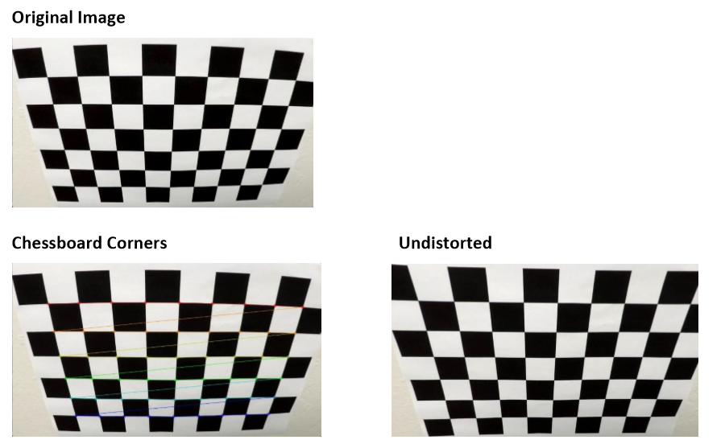
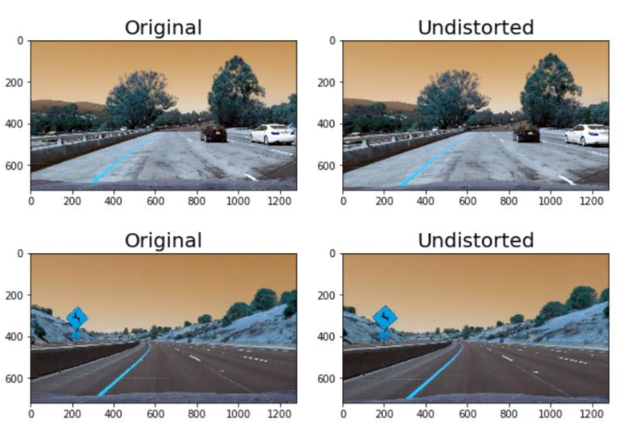
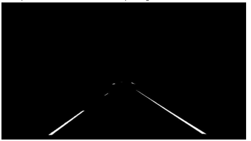
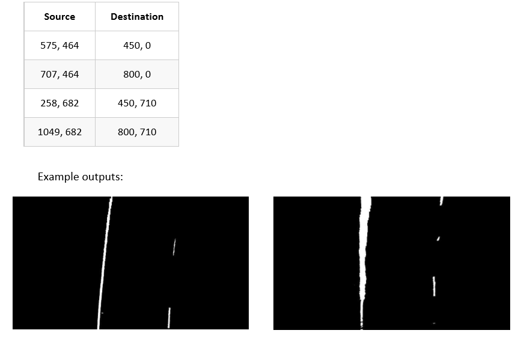
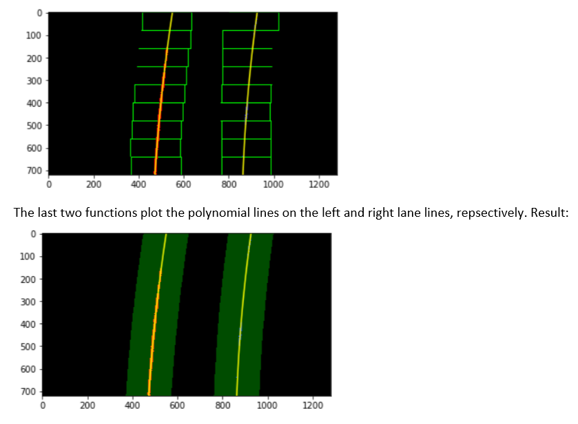
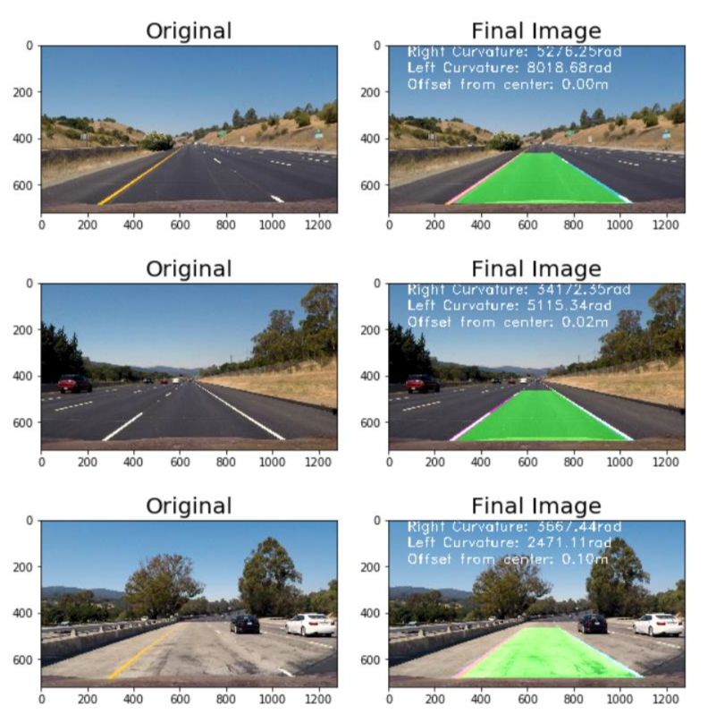

# CarND-AdvancedLaneLines-P4
Advanced Lane Finding Project 

#### The goals / steps of this project are the following:  

- Compute the camera calibration matrix and distortion coefficients given a set of chessboard images. 
- Apply a distortion correction to raw images. 
- Use color transforms, gradients, etc., to create a thresholded binary image. 
- Apply a perspective transform to rectify binary image ("birds-eye view"). 
- Detect lane pixels and fit to find the lane boundary. 
- Determine the curvature of the lane and vehicle position with respect to center. 
- Warp the detected lane boundaries back onto the original image. 
- Output visual display of the lane boundaries and numerical estimation of lane curvature and vehicle position

### Camera Calibration

**1. Have the camera matrix and distortion coefficients been computed correctly and checked on one of the calibration images as a test?**   
The code for this step is contained in the first code cell of the IPython notebook. The resulted calibration matrix and distortion coefficients from this step:  
 
Camera calibration matrix =   [[1.15777930e+03 0.00000000e+00 6.67111054e+02]  [0.00000000e+00 1.15282291e+03 3.86128938e+02]  [0.00000000e+00 0.00000000e+00 1.00000000e+00]]  
 
Distortion coefficients =   [[-0.24688775 -0.02373132 -0.00109842  0.00035108 -0.00258572]]  
 
As instructed during the lectures, I begin by preparing object points (array: objpoints[] ) which will be the 
coordinates of the chessboard corners in the world frame. As the images represent a flat chessboard, I assume 
z=0 and that the chessboard is fixed on the (x,y) plane. Using the function from OpenCV, 
cv2.findCessboardCorners(), I append the image points (array: imgpoints[]) by finding the corners in the images.  
As a last step, I am using the objpoints, imgpoints and the size of the image (h,w), to calculate the camera 
calibration matrix and the distortion coefficients, using the cv2.calibrateCamera() function. 
I apply this distortion correction to the test image using the cv2.undistort() function.   
The results of this pipeline:

 

### Pipeline

**1. Has the distortion correction been correctly applied to each image?**  

Distortion correction has been applied to every image, as described on the first question. The following image demonstrates the result:  

 

**2.  Has a binary image been created using color transforms, gradients or other methods?**  
A binary image has been created using color transforms.  
This can be found on the function thresholded_imgs in Advanced Lane Line.html   
On my initial tries, I experimented with Absolute Sobel Thresholding, Magnitude of the Gradient and Direction of the Gradient, as it can be seen in the function thresholded_imgs. I tried them in various combinations with and without the color thresholding and came to the conclusion that gradients are not very useful for this exercise. For this reason, I decided to only use RGB and HLS thresholds. I used the R and G thresholds on the RGB image for the yellow lines and S and L from the HLS image. The S channel is mainly used for the bright yellow and white lines. The L channel is mainly used for picking up the white lines, yet it completely ignores the white lines.    
Color Thresholds: R, G  
Channels: min 150  
S Channel: (100, 255)  
L Channel: (120, 255)  
After the color thresholding, I applied a mask in the region of interest in the image as we also did in the first project. The ROI in the image is: [0,h-1], [640, 400], [w-1, h-1]]  
Example of a thresholded binary image: 

 

**3. Has a perspective transform been applied to rectify the image?**  
The code for my perspective transform can be found on the function perspective_imgs(). This function receives as input the thresholded binary image and converts it to the bird-eye view. I have hard coded the values of the source and destination points:  
src = np.float32([(575,464), (707,464), (258,682), (1049,682)])  
dst = np.float32([(450,0), (w-450,0), (450,h), w-450,h)])  
The function also uses the OpenCV functions: getPerspectiveTransform() and warpPerspective()   

This resulted in the following source and destination points: 

 

**4. Have lane line pixels been identified in the rectified image and fit with a polynomial?**  

The lane line pixels have been identified and in the rectified image and fit with a polynomial, in the functions: find_lane_pixels() and fit_polynomial() search_around_poly() and fit_poly()  
 
The first two functions implement the sliding window technique and fit a polynomial on the left and right lane lines, respectively.   Result: 

 

**5. Having identified the lane lines, has the radius of curvature of the road been estimated? And the position of the vehicle with respect to center in the lane?**  

Yes, this has also been identified as it can be seen in the Final_Images. Examples:

 

### Pipeline (video)  

**1. Does the pipeline established with the test images work to process the video?**   

It sure does! The results can be found on the video: project_video_OUTPUT.mp4 

### Discussion  
The pipeline needs to be improved with respect to robustness. Probably, more transformation techniques need to be applied and different approaches of the pipeline should be examined. On the challenge video, the algorithm showed very crucial signs of incompetence. For the project_video, my approach seems to be working fine. But in real life situations and in different perceptual conditions, it is absolutely necessary for this pipeline to be improved in terms of robustness and reliability. 
